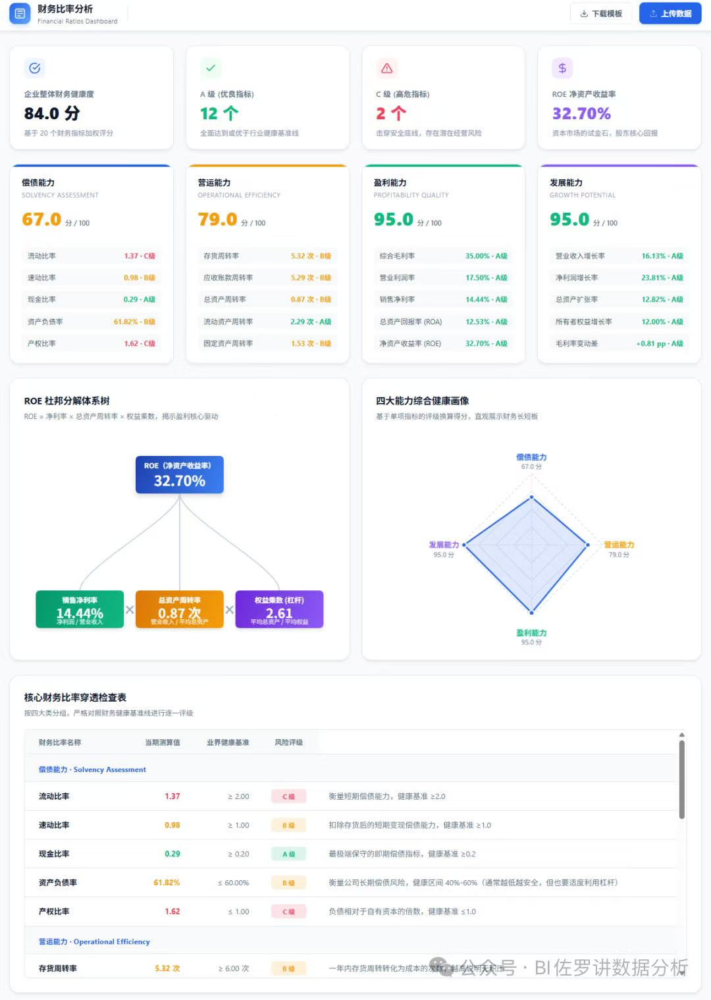

# 目的
一个简单的AI炒股助手、辅助我进行决策、大道至简，只关注价值、估值、成长性、确定性

## 如何衡量价值
品牌壁垒、护城河、商业模式

## 如何判断估值
估值不是一成不变的，如何判断当前估值是否合理 or 低估

## 如何判断确定性
ROE = 价值越大、越低估 、越确定

## 成长性
要有叙事性，比如AI，国产替代

# 如何实现
需要几大模块，个股、版块、推荐
个股：（参考财务指标：https://tushare.pro/document/2?doc_id=79）：列举重要财务指标以及品牌分析、商业模式、成本链、未来预测、跳到指定个股的时候可以展示对应个股的最近资讯、股东人数（https://tushare.pro/document/2?doc_id=166）、分红数据（https://tushare.pro/document/2?doc_id=103）、资金流向（https://tushare.pro/document/2?doc_id=170）、利润（https://tushare.pro/document/2?doc_id=33）、资产负债表（https://tushare.pro/document/2?doc_id=36）、现金流量（https://tushare.pro/document/2?doc_id=44）、主营业务构成（https://tushare.pro/document/2?doc_id=81）
板块:（分析平均值，板块信息：https://tushare.pro/document/2?doc_id=259）：需要列举板块中的个股信息，可以看出个股和板块的差异、跳到指定行业的时候可以展示对应行业的最近资讯
推荐（首页）：（支持推荐组合，按照个股的各种财务指标以及对应的pe综合打分，需要考虑企业中短期的利润变化导致的pe变化），参考：

产业链分析：

